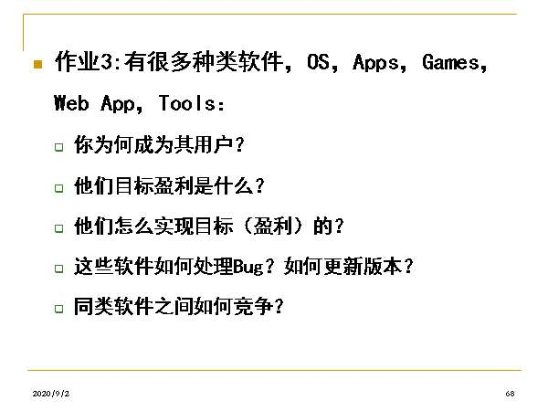
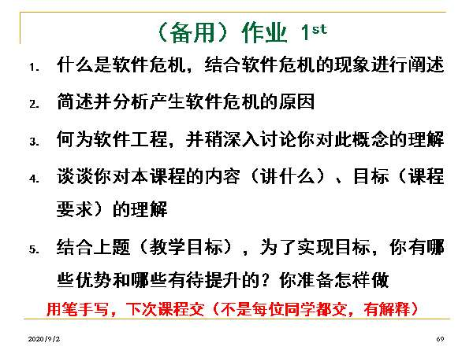
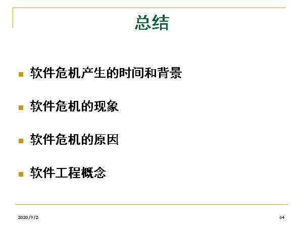
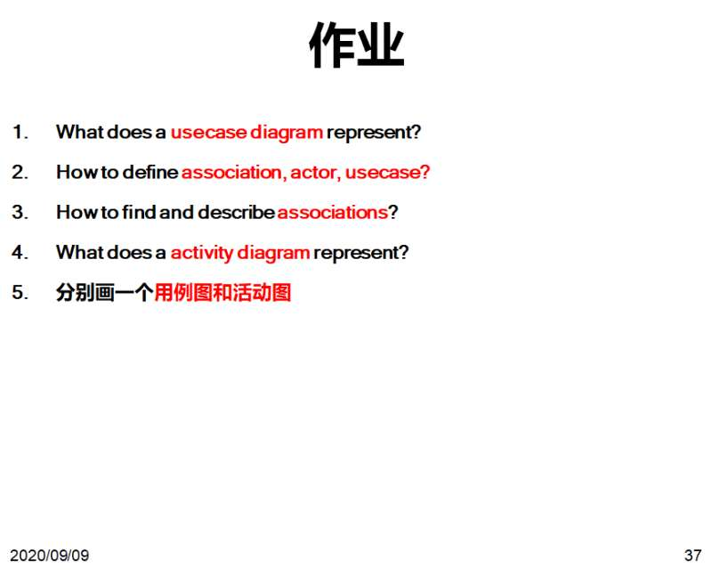
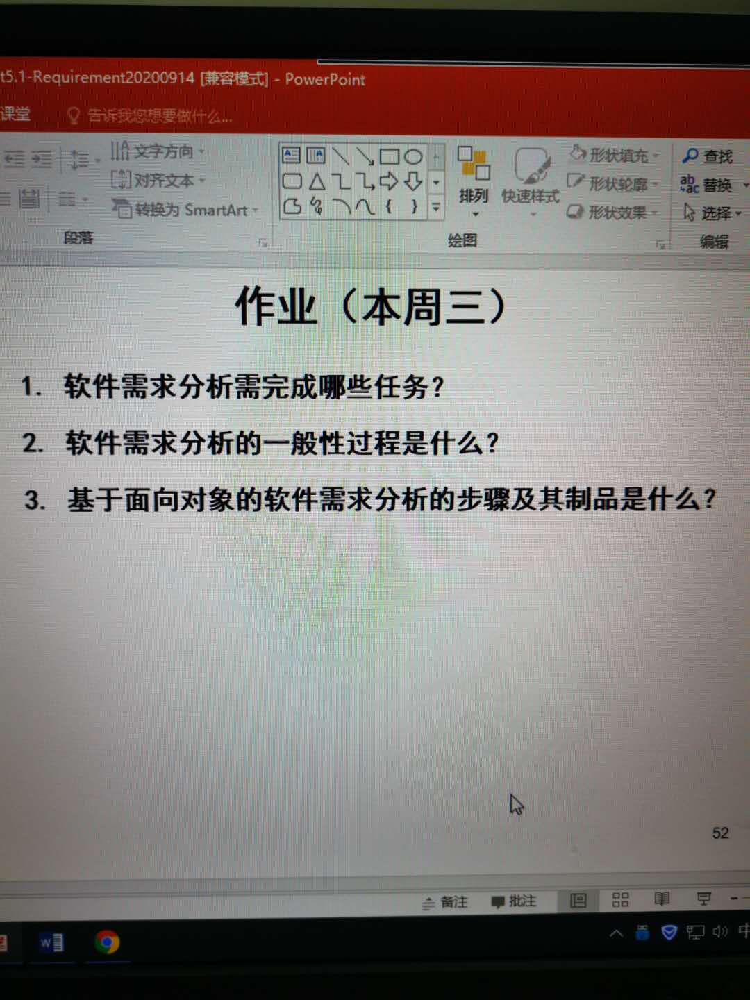
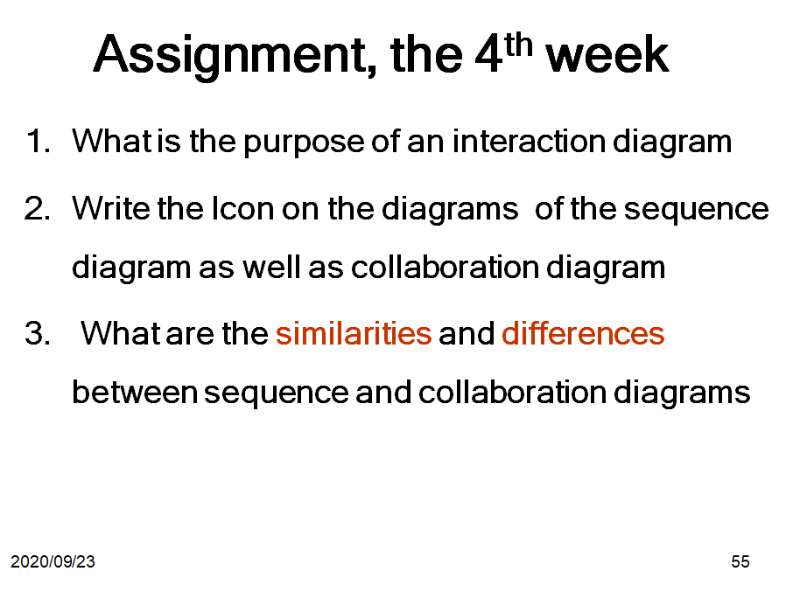
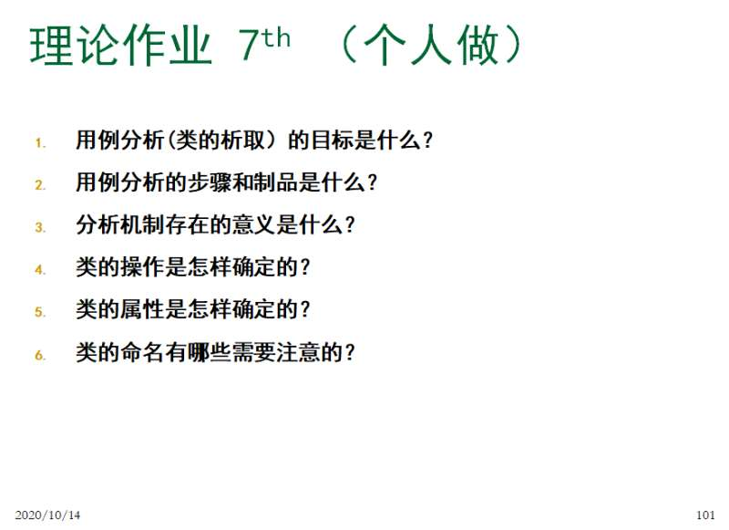

# 个人作业

> **必做内容：** 需要写入本人作业文档中
> 思考与总结：不强制要求写
> 可能需要时间加载图片。

- [个人作业](#个人作业)
  - [第1周作业](#第1周作业)
    - [1. 必做内容](#1-必做内容)
    - [2. 思考与总结](#2-思考与总结)
  - [第2周作业](#第2周作业)
    - [1. 必做内容](#1-必做内容-1)
  - [第3周作业](#第3周作业)
    - [1. 必做内容](#1-必做内容-2)
  - [第4周作业](#第4周作业)
    - [1. 必做内容](#1-必做内容-3)
  - [第5周作业](#第5周作业)
    - [1. 必做内容](#1-必做内容-4)
  - [第6周作业](#第6周作业)
    - [1. 必做内容](#1-必做内容-5)
  - [第7周作业](#第7周作业)
    - [1. 必做内容](#1-必做内容-6)

## 第1周作业

### 1. 必做内容

### 2. 思考与总结

## 第2周作业

### 1. 必做内容

## 第3周作业

### 1. 必做内容

## 第4周作业

### 1. 必做内容

## 第5周作业

### 1. 必做内容

## 第6周作业

### 1. 必做内容

## 第7周作业

### 1. 必做内容

